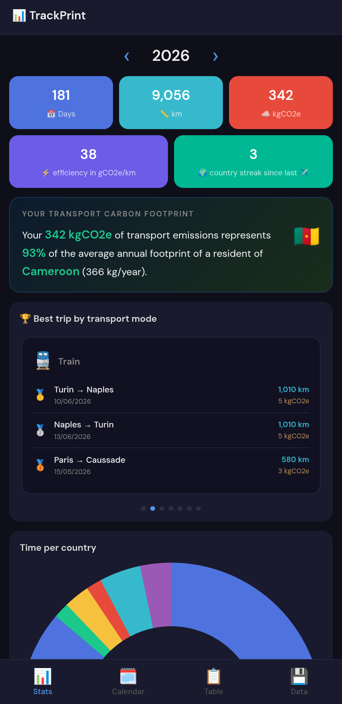
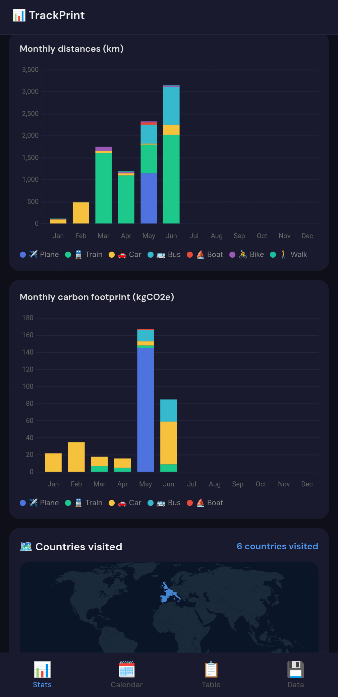
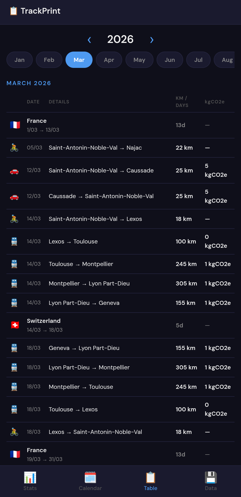
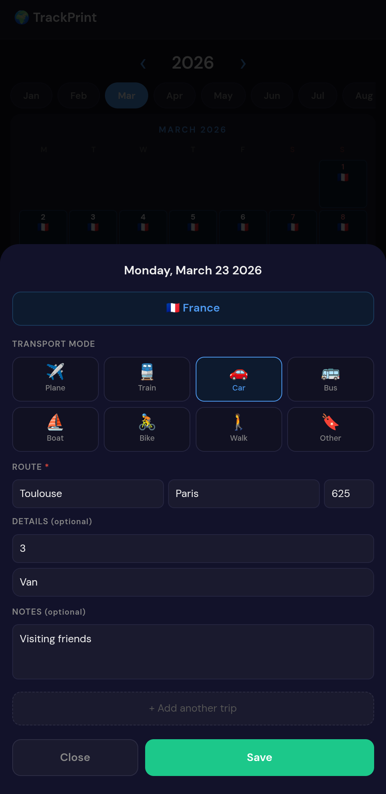

# 📊 TrackPrint

A personal travel diary to track the countries you visit, the distances you travel, and the carbon footprint of your journeys.

Data is stored **locally on your device** and never sent to any server.

<div align="center">

[](https://github.com/Pas-olo/TravelPrint/releases/latest)
&nbsp;
[](https://pasolo.pythonanywhere.com/)
&nbsp;
[](LICENSE)

</div>

## 📱 Installation

### Android
1. Download and install the APK from the [Releases](https://github.com/Pas-olo/TravelPrint/releases) page.
2. Open the APK and follow the instructions to install the app.

### iOS / Web
1. Open [TravelPrint Web](https://pasolo.pythonanywhere.com/) in Safari.
2. Tap the **Share** button (square with an arrow pointing up).
3. Select **Add to Home Screen**.
4. The icon will appear on your home screen like a normal app.

> ⚡ Tip: Even without an App Store version for iOS, this method lets you use TravelPrint like a real app!
> ⚠️ Note: On iOS, app data is stored in the browser cache. It **may be cleared by the system**, so make sure to back up your data regularly using the "Export Data" feature.


## Screenshots

   


## Features

- **📅 Travel diary** — log stays by country with start/end dates
- **🚗 Transport tracking** — record trips by plane, train, car, bus, boat, bike and more
- **☁️ Carbon footprint** — CO2e emissions calculated per trip using DEFRA 2025 factors
- **🗺️ World map** — visualize all the countries you've visited
- **📊 Stats & charts** — yearly overview: days on the road, total km, emissions, country streaks
- **📋 Log view** — browse all your entries month by month
- **💾 Export / Import** — back up and restore your data as a `.json` file
- **📱 Works offline** — no account, no server, all data stays on your device

## CO2 methodology

All emission factors are in **kgCO2e/km** and include upstream emissions. 
Full methodology is available in the app under **Data → Methodology**.

## Install

**Android** — download the latest APK from [GitHub Releases](https://github.com/Pas-olo/TravelPrint/releases/latest) and install it on your device.
> You may need to allow installation from unknown sources in your Android settings.

**Web** — try the live demo at [pasolo.pythonanywhere.com](https://pasolo.pythonanywhere.com/) (no install needed).

## Build from source

### Prerequisites

- [Node.js](https://nodejs.org/)
- [Capacitor CLI](https://capacitorjs.com/docs/getting-started)
- Android Studio (for Android builds)

### Steps

```bash
git clone https://github.com/Pas-olo/TrackPrint.git
cd TravelPrint

npm install

# Sync web assets to the native project
npx cap sync android

# Open in Android Studio and build the APK
npx cap open android
```

The raw web app (no Capacitor) can also be run directly by opening `src/index.html` in a browser.

## License

MIT — see [LICENSE](LICENSE)

*Borders, flags, and map data are based on available source files and libraries, and do not reflect any political stance or militant viewpoint.*

Paolo Sévègnes · MIT License